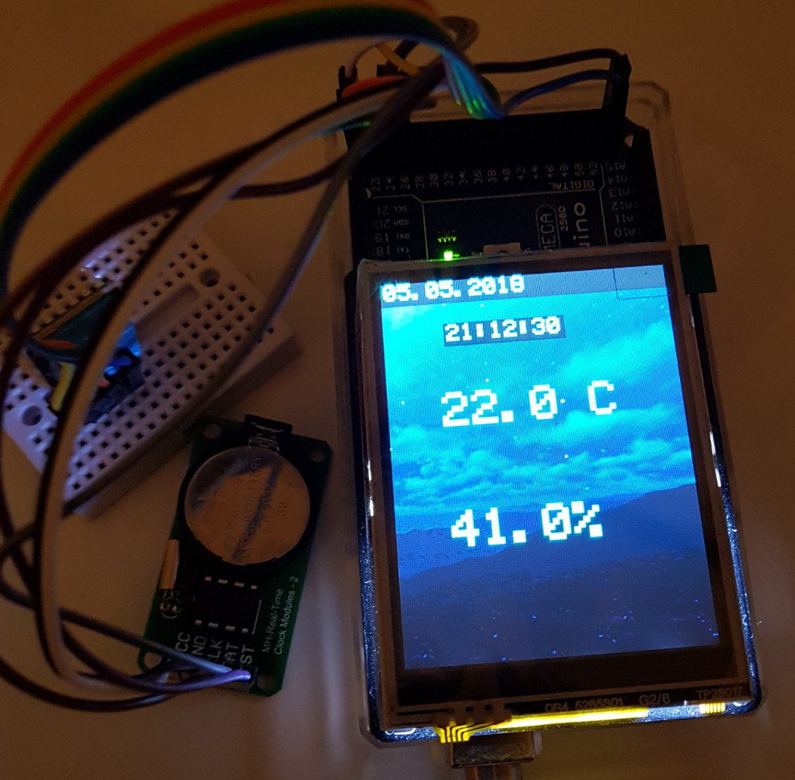

# Project:  THGadget
THGadget is a temperature, humidity and date/time arduino ATMEGA 2560 based device.
The sensors:  DTH11 and RTC HT1380

The main idea was to use the Holtek HT1380 RTC intead of the well known DS1302.

Estimated dev: 3hs.

## Hardware
- Arduino ATMEGA 2560 
- DHT11 sensor module 
- RTC HT1380 module with battery
- TFT Display V2 module from SeedStudio

## HT1380 Module
This is the standard DS1302 module, but I replaced it with the HT1380

## Required libraries
[TFTv2 by Seeed Technology Inc]:http://www.seeedstudio.com/depot/images/product/2.8touch%20shieldv2.jpg)](http://www.seeedstudio.com/depot/28-tft-touch-shield-v20-p-1286.html?cPath=34_36
[SD Library by SparkFun v1.2.1]: https://www.arduino.cc/en/Reference/SD
[Adafruit Unified Sensor V1.0.2]:https://github.com/adafruit/Adafruit_Sensor
[Adafruit DHT Library]:https://github.com/adafruit/DHT-sensor-library
[HT1380 library by Homin Lee]:http://www.suapapa.net
[Time Library by Michael Margolis v 1.5.0]: http://playground.arduino.cc/code/time

## References:
- [HT1380 Datasheet]:(./datasheets/HoltekHT1380.pdf)

(C) 2018,  Hernan Monserrat, License GNU GPL 3

